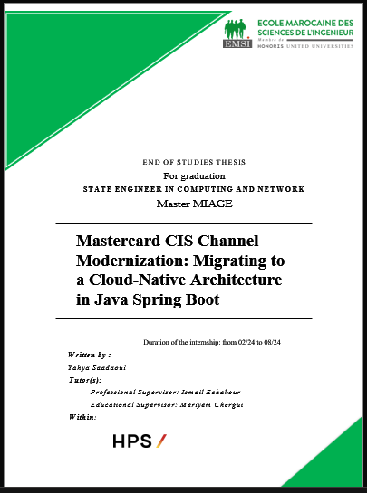

# Thesis Report: Mastercard CIS Channel Migration

This repository contains the LaTeX source code for my final-year engineering thesis. The report details the strategic migration of the Mastercard CIS (Customer Interface Specification) Channel from a legacy C-based monolithic system to a modern, cloud-native microservices architecture.

The project leverages a powerful stack including **Java, Spring Boot, Apache Kafka, Docker, and Kubernetes** to build a resilient, scalable, and maintainable payment processing solution for **HPS (Hightech Payment Systems)**.

[](https://www.latex-project.org/)
[](https://code.visualstudio.com/)

---

### 📸 Report Preview




## ✨ Report Highlights

This thesis provides a comprehensive overview of:

- **Monolith to Microservices:** A real-world case study of migrating critical financial infrastructure.
- **Financial Protocols:** A deep dive into the **Mastercard CIS protocol** and the **ISO 8583** message standard.
- **System Design:** Detailed architecture diagrams (UML, Sequence, Activity) illustrating transaction flows for both Issuing and Acquiring.
- **Modern Tech Stack:** Practical implementation details using Java, Spring Boot, Kafka, Docker, Kubernetes, RocksDB, and OpenTelemetry.
- **C vs. Java Analysis:** A technical comparison justifying the migration from a performance, maintainability, and DevOps perspective.

## 📁 Directory Structure

```
.
├── 📄 main.tex         # The main LaTeX file. Compile this one.
├── 🖼️ media/           # All images, figures, and screenshots.
├── .gitignore         # Files and folders to ignore (build artifacts).
└── 📖 README.md        # You are here.
```

## 🚀 Getting Started: Building the PDF

Follow these steps to compile the LaTeX source code into a PDF document.

### 1. Prerequisites

You need to install the following software on your Windows machine:

1. **MiKTeX:** A modern TeX distribution for Windows.

   - **Download:** [miktex.org/download](https://miktex.org/download)
   - **Important:** During setup, select the option to **"Always install missing packages on-the-fly"**.
   - After installation, open the **MiKTeX Console** and run the package updater to ensure everything is current.
2. **Strawberry Perl:** Required to run the `latexmk` build tool.

   - **Download:** [strawberryperl.com](https://strawberryperl.com/)
3. **latexmk:** A build automation tool that simplifies LaTeX compilation.

   - After installing Strawberry Perl, open a Command Prompt and run:
     ```bash
     cpan App::latexmk
     ```

### 2. Build Instructions

There are two ways to build the project. The VS Code method is recommended for its simplicity.

#### Method A: Using VS Code + LaTeX Workshop (Recommended)

This is the easiest and most integrated approach.

1. **Install Visual Studio Code:** [code.visualstudio.com](https://code.visualstudio.com/)
2. **Install the LaTeX Workshop Extension:** Open VS Code, go to the Extensions view (`Ctrl+Shift+X`), and search for `LaTeX Workshop` by James Yu.
3. **Open the Project:** Open this repository's folder in VS Code.
4. **Build:** Open `main.tex` and press `Ctrl+Alt+B` or click the "Build LaTeX project" button in the sidebar.

The extension will automatically use `latexmk` and the correct `xelatex` compiler to generate `main.pdf`.

#### Method B: Using the Command Line

If you prefer not to use VS Code, you can compile directly from your terminal.

1. Navigate to the project's root directory.
2. Run the following command:

   ```bash
   latexmk -xelatex -synctex=1 -interaction=nonstopmode main.tex
   ```

   This command tells `latexmk` to use the `xelatex` engine, which is required for the custom fonts used in this document. It will handle all the necessary compilation passes automatically.

## 🔧 Technical Details

- **Compiler:** **XeLaTeX** is used for its excellent support for modern fonts (`.ttf`, `.otf`) and Unicode, which is necessary for handling both English and Arabic text.
- **Key Packages:**
  - `polyglossia`: For multilingual typesetting (English and Arabic).
  - `fontspec`: To load custom system fonts like Times New Roman and Amiri.
  - `hyperref`: For creating clickable links, references, and a navigable table of contents.
- **Fonts Used:**
  - **Latin Text:** Times New Roman
  - **Arabic Text:** Amiri
- **Formatting:** A4 paper, 12pt font, 1.5 line spacing.

## 👤 Author

**Yahya Saadaoui**

- **Email:** yahyasaadaoui2019@gmail.com
- **LinkedIn:** https://www.linkedin.com/in/yahyasaadaoui/

## 📄 License

This project is licensed under the **MIT License**. See the `LICENSE` file for details.
